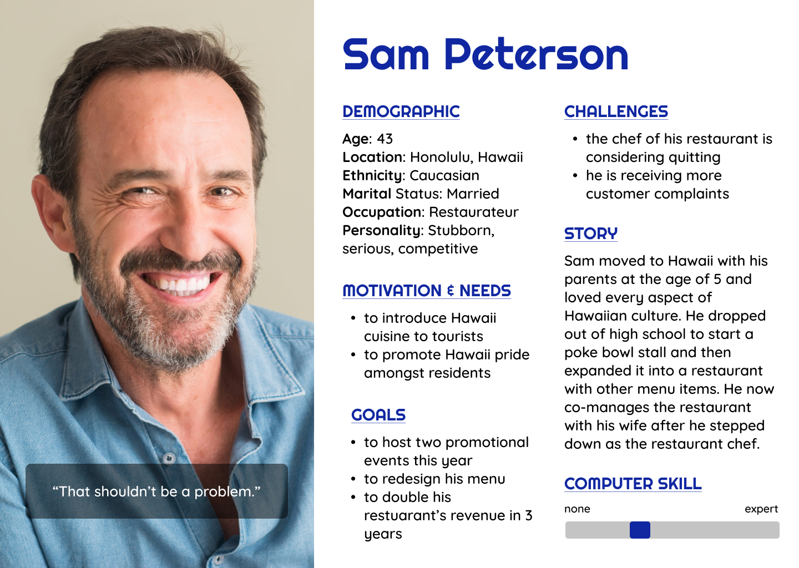
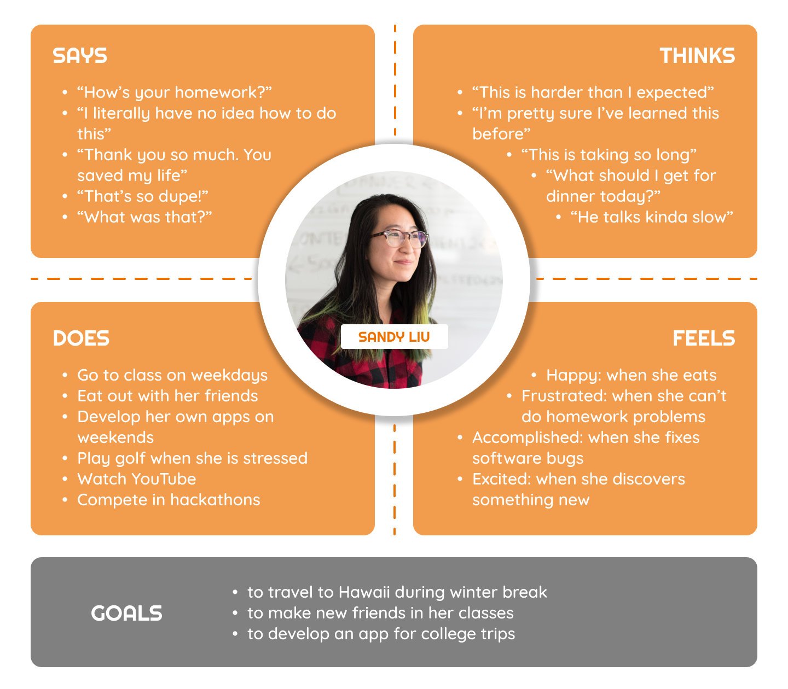
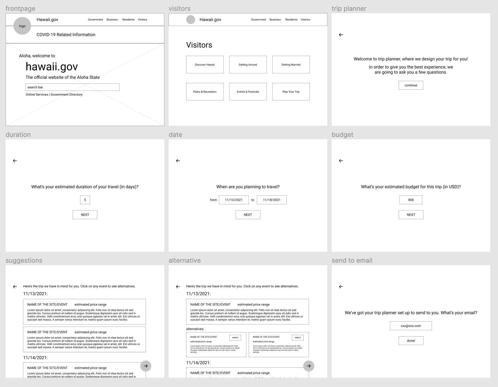
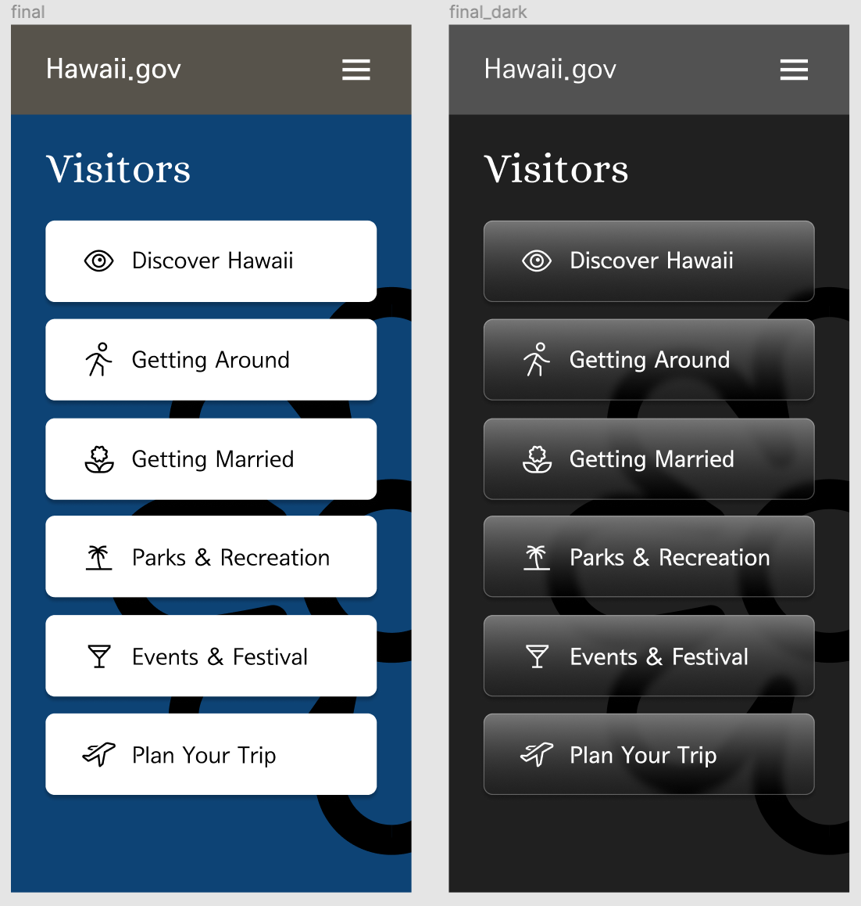
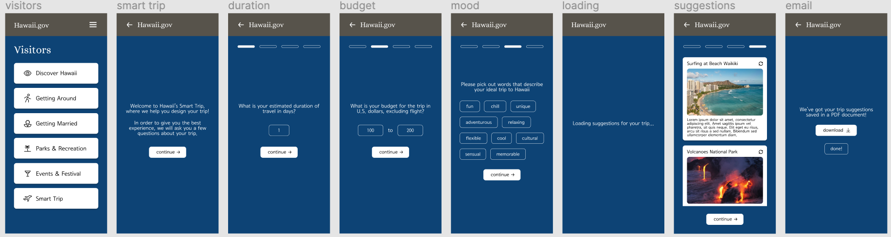

# Hawaii Smart Trip
Tony Xiong

## Introduction
Smart Trip is a feature on Hawaii's state website that provides popular traveling recommendations to visitors of Hawaii. Built on Hawaii's state website, as a part of their visitors' page, Smart Trip asks prospect travelers a few questions about their ideal trip to Hawaii, then provides them with a list of popular sites and events to visit based on their needs. This feature adopts a linear format, which makes the user flow intuitive and efficient. It is also user-friendly to visitors of all age groups.

## Design statement
Hawaii is a state that is booming with tourism. While visitors come thousands of miles to the Aloha state, most of them know very little about where to visit and what events to attend to optimize their experience. I hope that this feature could attract more tourists to Hawaii, which would result in both social and economic improvements for the state. It is also a great way for Hawaii to introduce its own culture to people around the world.

## Product analysis
To better understand the functionality and flow of Hawaii's state website, I conducted a heuristics evaluation on the Division of Boating and Ocean Recreation and the Department of Human Resources Development. I used Nielsen Norman's 10 principles of heuristics to identify the strengths and weaknesses of the website and its features. I discovered that even though Hawaii's state website is old-fashioned in its style, it does not sacrifice too much intuitiveness and has the right pieces in place for a makeover.

Read more here: https://github.com/Tonyhaoyu/DH110-TonyXiong/tree/main/heuristics#readme

## User research
I conducted user research, in which the participant followed my instructions to navigate around the webpage for Hawaii's Division of Boating and Ocean Recreation. I documented the event by screen recording via Zoom. I discovered that even though Hawaii's state website has a clear menu bar, the subsections are confusing for the user to navigate around and find information. The priority of features is also mixed up, which makes the website lack focus.

Read more here: https://github.com/Tonyhaoyu/DH110-TonyXiong/tree/main/assignment02#readme

In order to better understand user behavior, I conducted a contextual inquiry, combining observation with an interview. I asked the participant to introduce me to two websites he frequents and the actions he makes using these websites. I recorded both the interview and the observation study. The contextual was helpful in identifying users' needs for the design of the Smart Trip feature.

Read more here: https://github.com/Tonyhaoyu/DH110-TonyXiong/tree/main/assignment03#readme

## UX storytelling
I designed three different user personas to better connect with potential users for my Smart Trip feature. Through UX storytelling, I was able to solidify my vision as well as the direction of the design. I drew empathy maps for all three personas, as they reveal the details of my potential users and how they might behave when they are using the feature I propose. Understanding their goals is also pivotal in designing the priority of different elements on the final product.

Read more here: https://github.com/Tonyhaoyu/DH110-TonyXiong/tree/main/assignment04#readme

## Low-fidelity prototype
The interface design started with a low-fidelity prototype, which included all the elements for the features I proposed but stripped of decorative design elements. For testing purposes, I made the low-fidelity prototype interactive, so that test participants could navigate around the prototype provide accurate feedback. I conducted a short testing session on both of these designs and recorded the results using wire flow graphs and screen recordings.

Read more here: https://github.com/Tonyhaoyu/DH110-TonyXiong/tree/main/assignment05#readme

## Wireframe and graphic design element variation
The layout, colors, and typefaces are also carefully designed for an optimized user experience. I used grids to adjust the layout of the design, extracted colors from Hawaii's emblem for the main color scheme, picked typefaces that are both fun and professional, and ensured that color contrast satisfied the AAA requirement. I also designed a dark mode to optimize the user experience when they are using this feature in a dark environment. I conducted peer review to receive professional feedback on my design choice and adjusted my prototype accordingly.

Read more here: https://github.com/Tonyhaoyu/DH110-TonyXiong/tree/main/assignment06#readme

## High-fidelity prototype
The high-fidelity prototype of the Smart Trip feature is a product of user research, persona development, wireframing, and design variations. It encompasses many ideas and feedback from different sources to stand as an interactive product visualization. I implemented scrolling and switching animations using Figma to enhance the testing experience and conducted a cognitive walkthrough with other UX designers to identify areas of improvement. Brief user testings were also done to gain direct feedback on the high-fidelity prototype to ensure that the flow of the wireframe is intuitive.

Read more here: https://github.com/Tonyhaoyu/DH110-TonyXiong/tree/main/assignment07#readme

## Pitch video
See a five-minute pitch of the project here: 

## Conclusion: what you learned throughout the process
The UX design process for this project was all-encompassing, as included heuristic evaluations, user research, UX storytelling, prototyping, and cognitive walkthrough along with other aspects that are pivotal to the presentation of the final product. Each aspect was executed professionally and when minor errors were discovered, they were fixed in a prompt fashion.

In terms of UX research, I conducted user interviews and heuristic evaluations, which were areas that I did not touch on in previous projects. Through talking with potential users and analyzing the website that I will be proposing a feature for, these processes are deemed to be essential to the design process, as they helped me identify the areas that I need to pay more attention to.

In terms of design, I studied the layout, colors, and typography in-depth, which elevated the visual presentation of the final product. Details such as the color contrast and layout grids were often ignored in my previous projects, even though they are important in effectively reaching a wider audience. I also gained more experience with Figma, from using it as a low-fidelity prototyping tool to an interactive presentation tool, I explored aspects of this product that I did not know before.

Overall, the project was a success. I was able to not only learn important UX and UI skills that are all useful in the industry but also gained valuable experience through the process of running a UX project by myself.
