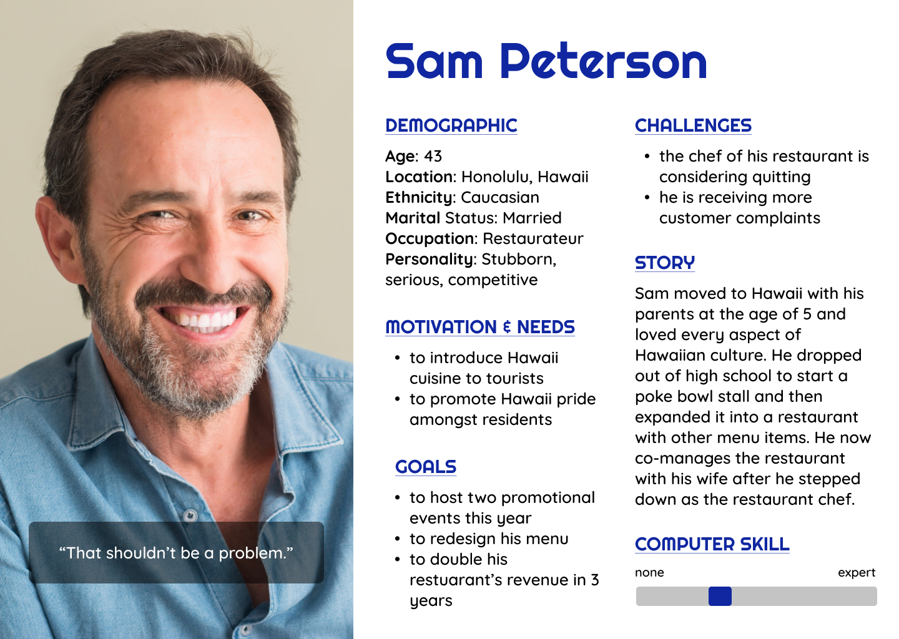
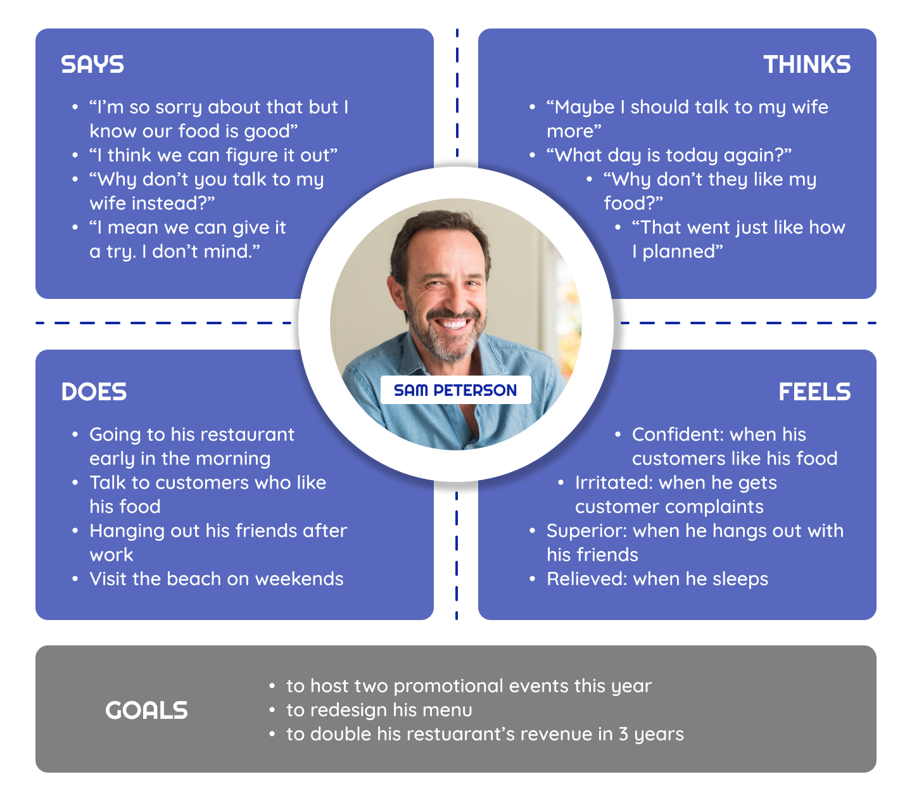
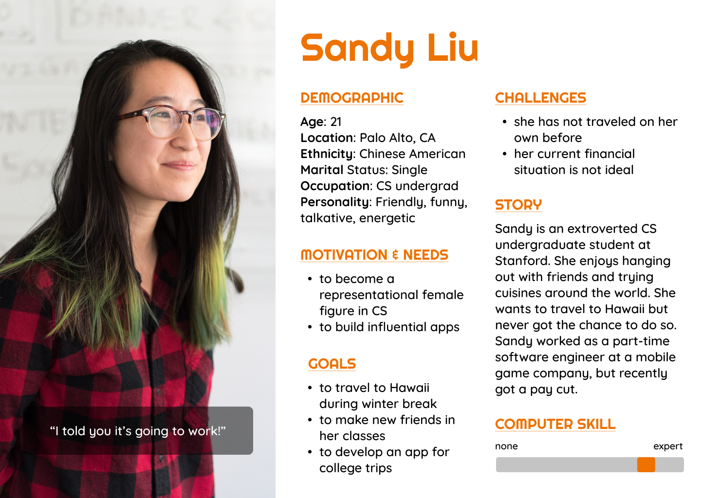
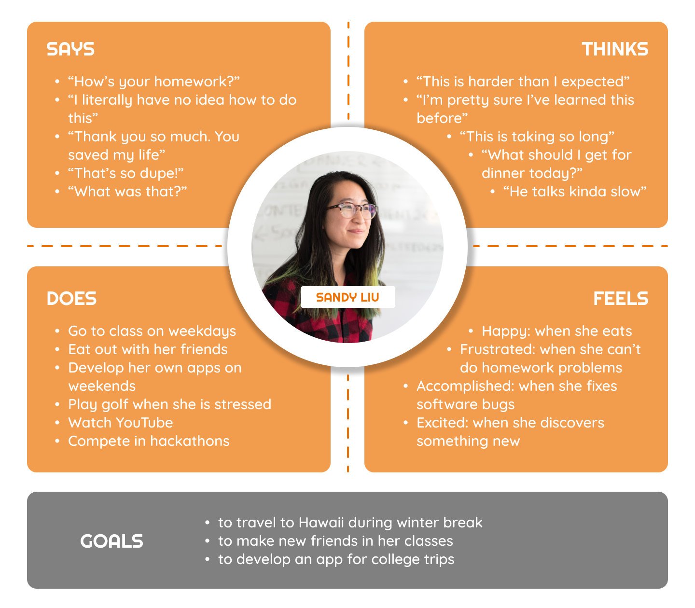
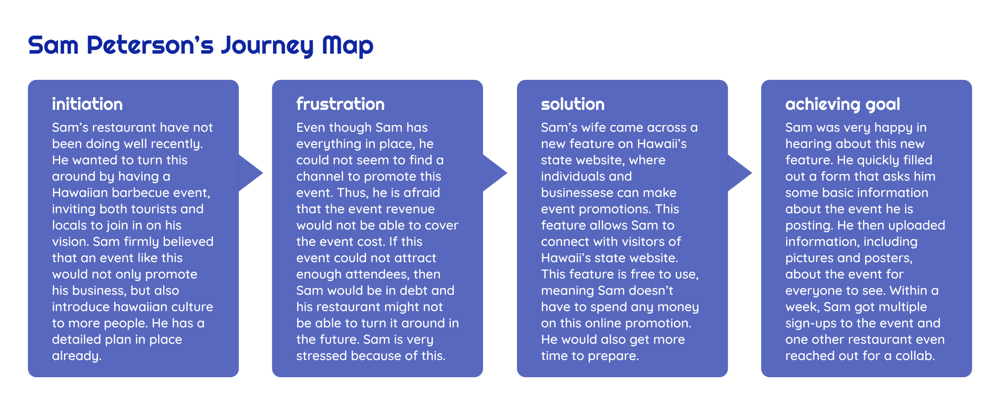
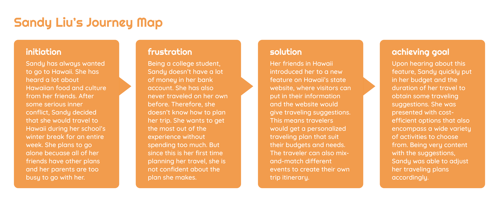

# DH 110 Assignment 04
Tony Xiong | DH 110 | Fall 2021

## Persona + Scenarios
### The Purpose of UX Storytelling
UX storytelling is especially crucial to my project, as being able to identify with potential users and gain their perspectives would enhance the human-centered design experience of the product. By building user personas, I also clarify my own vision of how my product should deliver the most effective information. Since I am re-designing Hawaii's state website, it is important to eliminate any biases so that every user can equality enjoy the navigation process. Having journey maps also help me to clearly identify the users' problem and their actions towards the solution we offer.

## User Persona + Empathy Map

## Scenario + Journey Map
### Feature 1 - Event Promotion (with Sam Peterson)
Event promotion allows individuals and organizations to post event information, including texts, posters, images, and videos for the public to view online. The end user can browse through a variety of events/promotions posted and directly contact the hosts via the contact information they provide. This feature is free.
#### Why is Sam using this feature?
Sam is a restauranteur in Hawaii. However, his business has not been doing well recently. In order to increase the publicity of his restaurant and restore its popularity, Sam is trying to host a promotional event: an upscale Hawaiian barbecue. Because of this, Sam is in need for a convenient and effective method to reach more people. Since his restaurant is running low on cash, Sam can't afford billboards and online advertisements, but if he doesn't take any promotional actions, the profit he gains from the event would not be able to cover the cost. Therefore, the event promotion feature on Hawaii's state website would work perfectly with achieving his goal. Sam would not have to spend money since this feature is free to use, and he would also be able to save time for the actual planning and preparation fo the event.
#### How is Sam using this feature?
This feature can be accessed through any smart device with an internet connection, such as a smartphone or a laptop. Sam would have to first fill out a form that asks for some basic information. He would input the name, the date, and the scale of the event, and his contact information, so that the website's algorithm can group Sam's event with other similar ones. Sam would then upload information about the event. He would post the posters, the schedule, or the list of attendees for the event. After Sam is done with this registration process, his event is officially posted. The website would then provide live updates to Sam's post. He would check to see how many people have viewed his post and respond to any relevent inquiries. When Sam discovers a mistake in his post or when there is an update to the event, he could edit his original post.

### Feature 2 - Travel Planner (with Sandy Liu)
The travel planner uses algorithms to provide users with personalized travel itineraries. After the user inputs relevant information, including their budget and the duration of the travel, the website would give them a list of suggestions accordingly. The users can then add these suggested tourist attractions and events to their traveling plan. The feature greatly saves the time travelers spend planning their trip and it offers great customizability for the travelers. 
#### Why is Sandy using this feature?
Sandy is an undergraduate student who dreams of traveling to Hawaii. After she finally made up her mind to do so, she discovered that all of her friends have plans for winter break and her parents are too busy working. As a result, Sandy decided to spend one week in Hawaii on her own. However, having no prior traveling experience, Sandy has no idea how to formulate the plan for her trip. As a college student, Sandy also doesn't have a lot of money, so she has to limit her expense for the trip too. But thanks to the travel planner provided by Hawaii's state website, Sandy doesn't have to worry about the logistics too much. She simply put in her information, and the website suggested her with cost-effective routes for the duration of one week. This feature is perfect for someone like Sandy, who lacks traveling knowledge and is in need of careful planning.
#### How is Sandy using this feature?
Sandy would access this feature through her laptop. She would input some basic traveling information, including the duration of the travel, the price range (her budget), the date of her travel, and the type of trip she prefers (cultural, natural, entertaining, etc). She would then receive a list of suggestion, often including different sites, events, and promotions that fit her answers. Sandy would now browse through all the options, select the ones she is interested in, and save them on her itinerary. She would also mix-and-much between the options to come up with her own traveling plans. After Sandy is done with her trip planning, she will simply follow the plan she made and enjoy the trip with no hassle.

