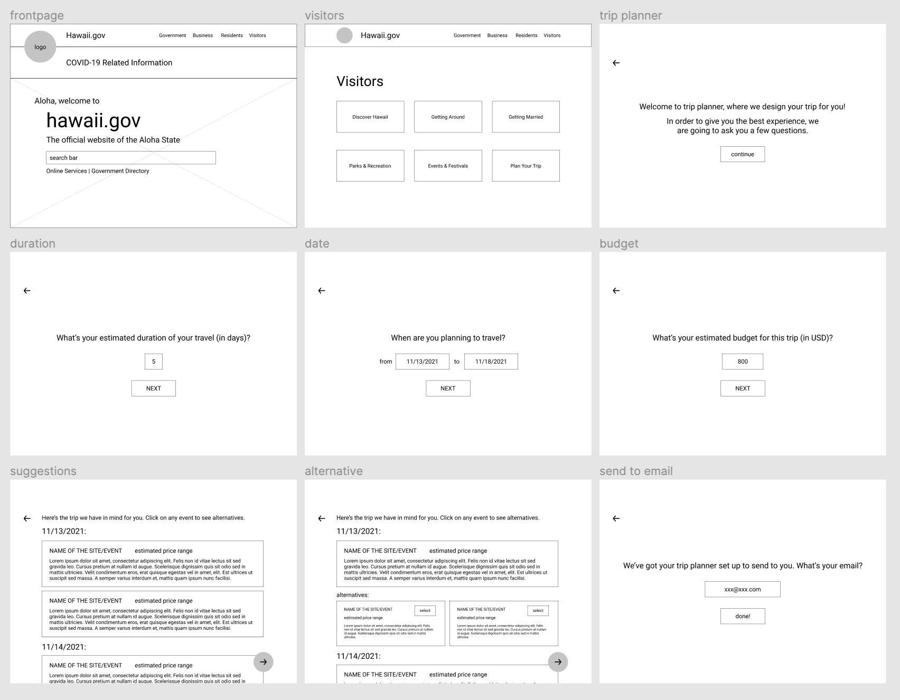
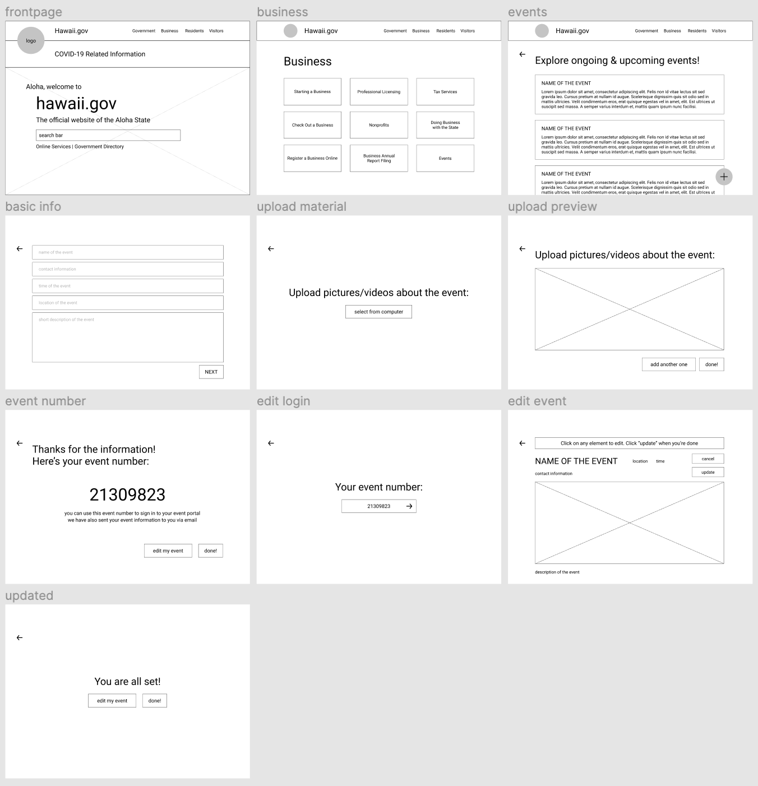
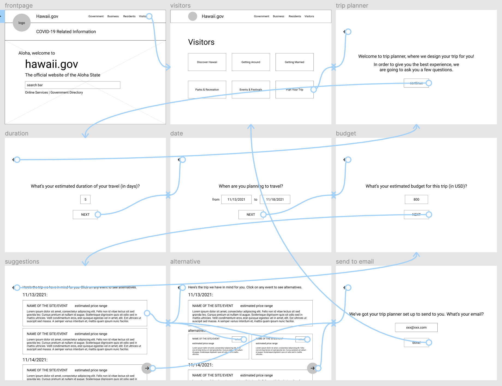
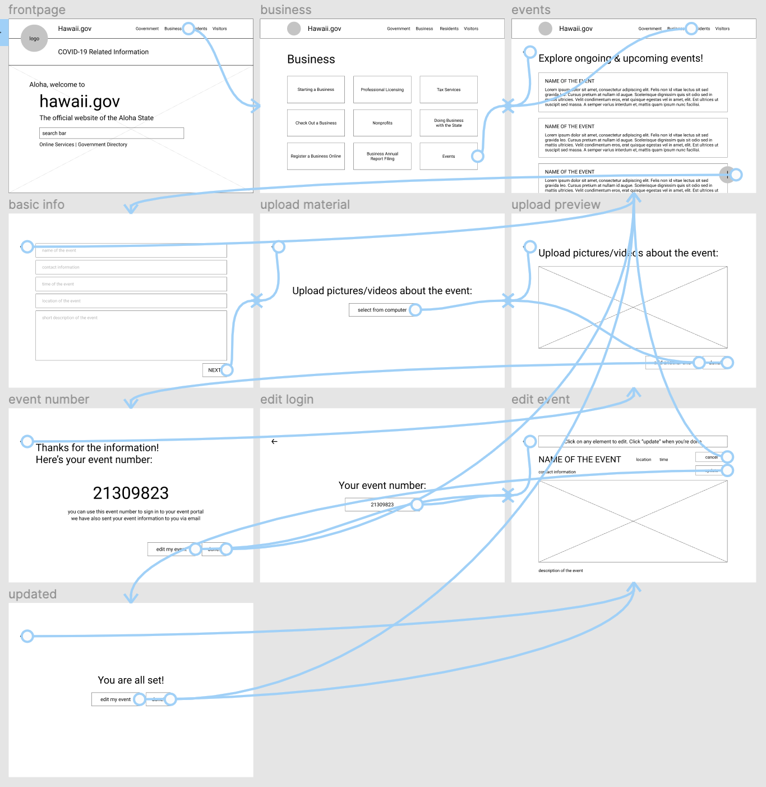
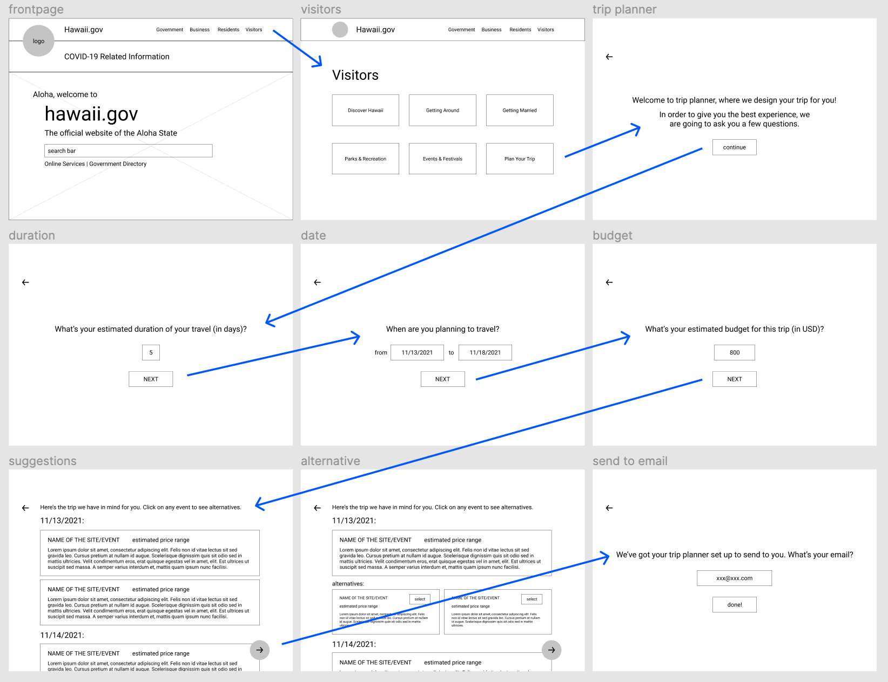
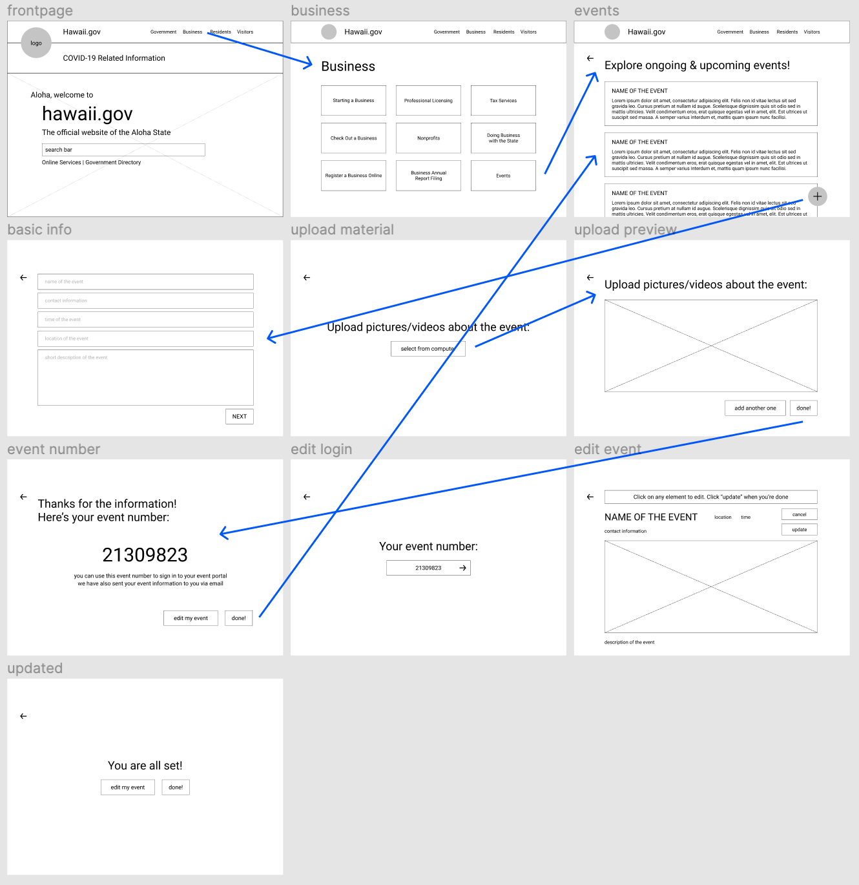

# DH 110 Assignment 05 - Low Fidelity Prototype
Tony Xiong | DH 110 | Fall 2021

## Overview
The purpose of a low fidelity prototype is to present a testable and visually identifiable design to aid the process of creating a higher fidelity prototype. The advantage of a low fidelity prototype is that if a user problem occurs or if a design is less than ideal, adjustments can be made in an early stage. For this assignment, I am using Figma to design the low fidelity prototype for the two features I proposed in assignment 4: trip planner and event posting. The trip planner  asks visitors relevant questions to generate personalized traveling plans; the event posting feature helps businesses and individuals to promote events by posting them publicly.

The reason behind choosing Figma over hand-drawn designs is the flexibility of the tool, where changes can be made easily and testing can be done over the internet. The user persona that I created in assignment 4 are a student who wants to visit Hawaii and a bussiness owner who wants to promote an event on Hawaii. These two scaenarios call for the need for the trip planner and the event posting features respectively. The low fidelity prototype, after its completion, will be given to a potential user of Hawaii's state website to test. Since the two features are not correlated with one another, they are designed seperately and will be tested seperately too. The results of the test will contribute to the high fidelity wireframe designs and future improvements in user experience.

## Wireframes and Wireflows
The following two images are the wireframes without the wireflows for clarity.

### Trip Planner:

### Event Posting:

The following two images are the wireframes with wireflows for a better representation of how the features can be used in real life. I chose to use Figma's prototyping tool to design the wireflows so it can be tested over the internet and shareable with a link.

## Prototype Testing
The low fidelity prototype was given to Xiaojian, who participated in my user study. He was asked to walk through the wireframe to complete the tasks of the two features. His actions were observed and recorded.

Here are the short recordings of Xiaojian's tests on the two features:

Trip Planner - 

Event Posting - 

Here are the pictures of the low fidelity prototype with arrows indicating Xiaojian's course of action throughout the testing process:

### Testing insights: 
