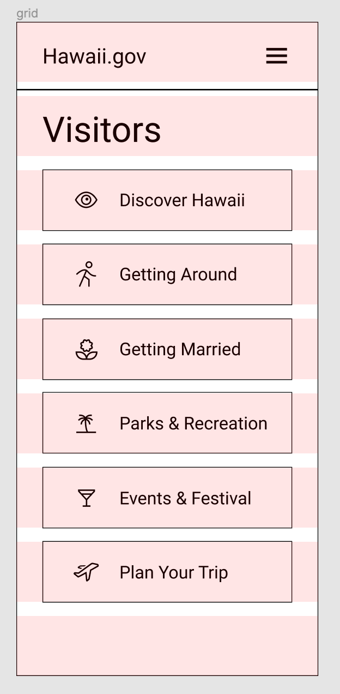

# DH 110 Assignment 06 - Interface Design
Tony Xiong | DH 110 | Fall 2021

## Summary
The purpose of this interface design assignment is to identify and solidify the design style, including the typography, the shapes, and the colors for the new feature we proposed. By doing this interface design and conducting an impression test, I can pick out appropriate designs to apply on the entire feature I proposed. For this interface design, I picked the "visitor" page for the feature "trip planner" since it has relatively more design elements than the other pages. In addition, it also shares similar structure with most of the other pages for trip planner, which makes it a good choice for this interface deisgn assignment.

Link to the figma file: https://www.figma.com/file/0xXF76rpW3WmpsQavwiLlJ/Hawaii-Interface?node-id=0%3A1

## Grid
I adopted horizontal grid as it fits the overall layout of the page I chose. I made adjustments based on the grid, which is 9 rows with a 20 gutter size.

## Typography
I experimented with three different typographies to see which one fits my style the most. The feel I was going for was "lively but also professional". The first font family I went with was Quicksand, which is a lean sans serif. However, it looked quite mundane and lacked the vividness I was looking for. I then used Rock Salt as my title font and Amarante for the body text. This was an improvement from the first attempt, but it was a bit too extravagant and users might find it too artistic. The third variation I chose was Ribeye for the title and Alice for the body text. This combination struck a very good balance between artistic appeal and professionalism. Hence, I settled on this typography and moved forward.

## Shape

Since the visitor page contained many buttons, I mostly experimented with the roundness of these buttons as well as the stroke type. I first dropped a shadow of 4 on the Y axis with a blur of 4 to highlight the buttons. I then made the buttons completely rounded, with 100 in roundness. Although the shadow worked well to draw attention to the buttons, the roundness lacked professionalism and almost looked cute. I toned down the roundness of the corners to 10, which yielded a better result. For my third design, I tried making the stroke of dotted, but it did not look professional enough and might not convey the message that these are indeed buttons. Therefore, I stuck with the second variation.

## Color
I made four variations in colors, including two for dark mode. I extracted some iconic colors from Hawaii's state emblem and applied them onto both of my designs. However, since the first color scheme was too bright and lacked contrast, I went with the second one.

For the dark mode, I started with a dark background and white buttons design, which was recommanded by Google's material design guidelines. However, since the size of the buttons are quite large on the visitor page, practically taking up the entire screen, they might be too bright for the user's comfort. Therefore, in my second variation, I took away the white fill on the buttons and only kept the outline. Since it worked better in terms of both visual appeal and practicality, I moved forward with this second variation.

## Impression Test
Here are the two designs I used for the impression test:

I asked Emily Wang, who is a UX designer on one of the projects that I am currently working on for an immediate feedback on the designs that I presented. Here are some of the feedback she offered:

"I like it!"

"The design is a bit too simple...it's alright but maybe you can add something in the background or like use different colors"

"The white buttons really pop out"

"I like the blue background"

"I really like the icons"

"I think it's very clear...like all the things a user can do"

"Maybe work on the dark mode cuz I think it can be better"

"I like how you used two different fonts"

From these feedback, it is not hard to see that Emily enjoyed the overall interface design I presented, especially the color scheme and the use of icons. For instance, the white buttons pop out, which means it could grab the attention of the users easily and direct their actions. The icons are also a good addition since they aid the users in identifying their actions, in case that the texts are not clear enough. However, she did mention not once, but twice on how the dark mode could be done better. She stressed that the buttons don't feel like buttons since they are only outlines, and she also pointed out that my backrgound design is a bit simple. Therefore, I added a glassmorphic effect on the buttons for the dark mode to convey the fact that they are indeed buttons. I also added a background pattern that is not too distracting but also works to enrich my design. Here are the two frames after the impression test:

## Accessibility
I conducted a color contrast accessibility test on both the regular and dark mode designs. Here are the results:

As shown, they have both passed the 4.5:1 color contrast test (AAA level) by a comfortable margin. This ensures that from a color standpoint, most people can easily identify with all the objects on the page and not stress too much on recognizing, or failing to recognize, any elements.

## Design System
Typeface: SeoulNamsan (body), Alice (header)

Font Size: 45 (header), 30 (subheader), 25 (body)

Color scheme: 0C4377 (background), FFFFFF (primary), 000000 (secondary), FFFFFF (focus)

Color scheme for dark mode: 202020 (background), FFFFFF (primary), 777777 + 3D3D3D linear fill

Layout grid: 9 rows, 20 gutter

I picked the font SeoulNamsan for its formality since it is a serif font. But at the same time, it also has a bit of fun character to it, which makes it a good complement with the font Alice, a slim sans serif font. Hawaii, being a tourist state that is fun and vibrate and a governmental state itself, deserves a combination of these two fonts. The color scheme was picked out from the Hawaii state emblem to represent the state as a whole. While the emblem contains many colors, I settled with blue and white since they resemble the ocean, a big part of Hawaii's attraction on the outside. I also incorporated the icon of a flower as the background as Hawaii is deeply connected with its nature. I used slightly rounded corners to make the button look less sharp and more welcoming. Icons are added to aid the understadning fo the texts on the buttons. Overall, this interface design is supposed to give off a sense of calmness and professinalism, and based on the impression test and the revisions I made, this goal seems to be achieved realteively successfully.
