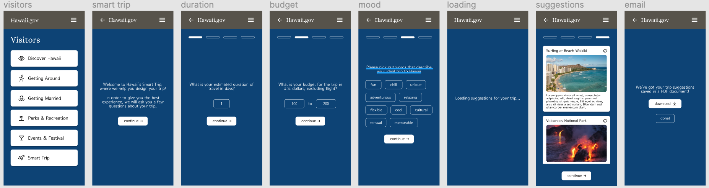
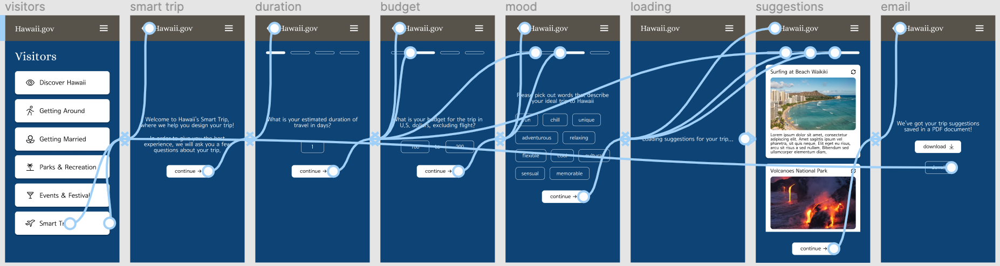
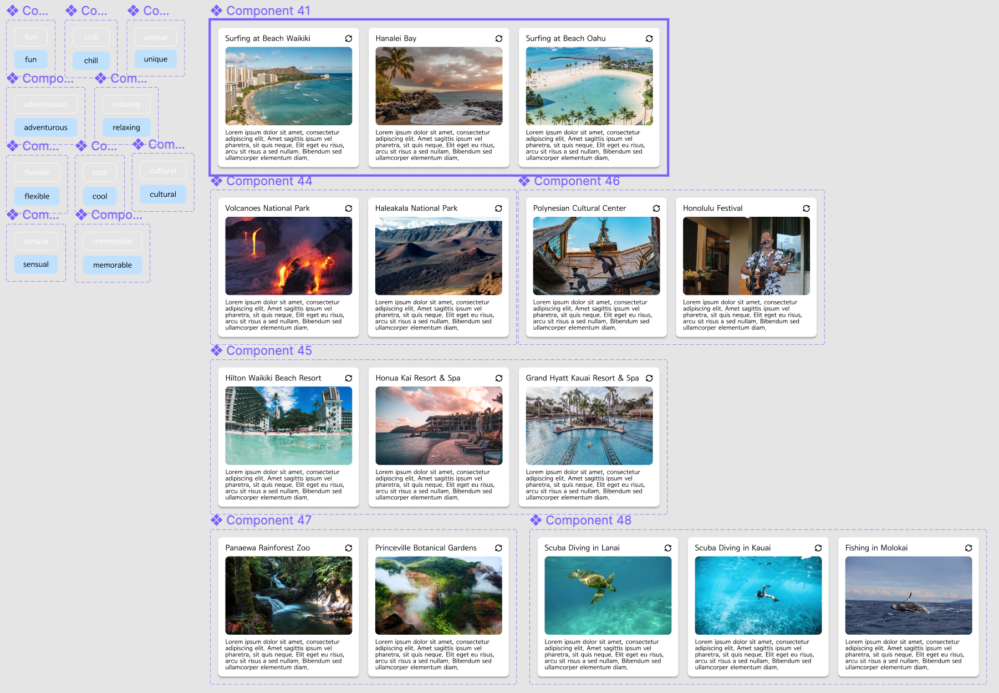

# DH 110 Assignment 07 - Interface Design
Tony Xiong | DH 110 | Fall 2021

## Summary
This interactive prototype is for the feature "Smart Trip", which provides travellers popular tourist site and event suggestions. This feature is placed under Hawaii's state website's visitor section. Upon entering, the users would be asked a few questions regarding their trip plans. Then, the system would provide the user with a list of suggestions that match their answers. The users can Smart Trip helps users to plan their trip better. The purpose of a high-fidelity interactive prototype is to emmulate the real feature and to improve the accuracy of feedback in user testing. The addition of details also helps me to identify elements that should be changed or removed.

## List of Tasks
### User Survey
In order to provide the users trip suggestions that fit their need, we need to understand what the users want from their trip. This user survey asks the users the duration of their travel, their budget, and what they want from an ideal trip to Hawaii. The duration of travel would determine how many suggestions to give the users, as a longer trip would mean more places visited. The budget would decide the price range of the tourist sites and resorts suggested. The words the user chooses to describe their trip would be directly connected to the suggestions: a chill trip would lean towards resorts and spas and an adenturous trip would lean towards volcanoes and scuba diving. I used scrolling animation for duration and budget, and multiple choice for mood using component variants.

### Suggestion Alternatives
After Smart Trip provides suggestions to the user, the user has the choice to pick an alternative to each suggestions made. For instance, if the user does not like 
visiting Volcanoes National Park, they could click on the switch icon for a similar alternative, for instance, Haleakala National Park. This task offers great flexibility to the users, as they have some degree of control over their preferences without compromising the goal of the Smart Trip feature itself. I used both scrolling and component variants to closely emulate the working product.

## Wireflow
Link to the Figma file: https://www.figma.com/file/uzeYiSpDX02PF1GrtYV0P5/Interactive-Prototype?node-id=0%3A1

Image of the graphical interface:

Image of the prototype with wireflows:

The components I used for the "click to switch" animation:

## Cognitive Walkthrough
