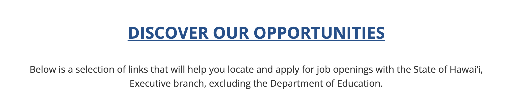

# Hawaiian Experience from a Civil and Recreational Standpoint

## Assignement 1: Heuristic Evaluation

Tony Xiong | DH110 | Fall 2021

### Project Overview:
Hawaii is a fun state. While travel and recreations are some of the biggest source of reputation and income for the state, the designs of Hawaii's official websites lack many elements that highlight the strenghts of these divisions. In this assignment, I am going to explore different aspects of Hawaii's website from the standpoint of the Division of Boating and Ocean Recreation and the Department of Human Resources Development, as well as conducting a heuristic evaluation on these two divisions. I will primarily adhere to Nielson's 10 rules of heuristics in my evaluation. As a result, I will be able to identify the strenghts and weaknesses of Hawaii's official websites and offer suggestions that could contribute to an improvement in the website's visuals, intuitiveness, and experience.

### Severity Ratings - Nielsen Norman Group:

1 = Cosmetic problem only: need not be fixed unless extra time is available on project

2 = Minor usability problem: fixing this should be given low priority

3 = Major usability problem: important to fix, so should be given high priority

(credit: https://www.nngroup.com/articles/how-to-rate-the-severity-of-usability-problems/)

## Website 1: Division of Boating and Ocean Recreation

Link to the website: https://dlnr.hawaii.gov/dobor/

The Division of Boating and Ocean Recreation strives to preserve Hawaii's natural and cultural resources and also providing access of these resources to residents and visitors. Many recreational activities, including boating and surfing, are under the juristiction of this division.

Overall Evaluation: The website for the Division of Boating and Ocean Recreation is standard looking, but also information, as it does not contain fancy animations and avant garde styles. However, this could be a negative attribute for a division that is directly in charge of oceanic recreation. The frontpage presents 5 dropdown menus as well as multiple button that would navigate users to different pages, which could be useful and confusing at the same time. Most pages adopt a left-right structure, having a column that goes straight down, which takes up 1/3 of the entire page on the right. This could be distracting visually, as it skews the balance of the website's layout, making visitors lose focus.

#### 1. Visibility of System Status

While the website provides the most basic forms of visibility cues, these cues are not done effectively and sometimes completely omitted. In one case, no visual cues are given for a list of dropdowns, which could confuse the users. When a wrong password is entered, the system does not give any meaningful response to the user besides refreshing the page. In addition, when a user types in the search bar, a list of suggestions does not appear, rendering this human-computer interaction less than ideal, as the user does not get a feedback from the system. Though all these problems suggest a lack of visual cues, the website does adopt some visibility of system status, just not on a consistent basis. (2)

Recommendation: The website should incorporate more visual cues that informs the users of the validity of their actions. One  would be having a list of suggestions for a user search, effectively telling the user that the system is aware of their action, and is trying to make the process easier. The website should also add an error message when the user makes a wrong input or a call for further actions.

#### 2. Match Between System and the Real World
The website often fails to distinguish between links and important notices, by having hyperlinks that are not underlined and plain texts that are underlined. This would confuse users, as they would mistaken call-to-actions with plain texts. It also does not align with common internet standards, as underlines are usually associated with hyperlinks instead of texts. The right 1/3 of the website stays the same no matter what sub-page the user is on, which is both not intuitive and confusing. (2)

Recommendation: Instead of having a stationary section on every page, we should consider adding either an extra dropdown menu or having these information at the bottom of the webpage. The website could also avoiding using underlines on non-hyperlinked texts, and considering exchanging these with bold letters or italics.

#### 3. User Control and Freedom

This is no clear indication of the previous actions taken by the user, meaning the users might find it difficult navigate back and forth. Instead, the website relies on the built-in back arrow button on the web-browser, which is less useful in recalling actions. In addition, the user have little control over the scholling motion of the pictures on the frontpage. (2)

Recommendation: The website should have a small list of actions on top of the page that contains the names or actions the users have taken so far. This would allow the users recollect the actions they took and move in between steps much easier. Regarding the scrolling animation on the frontpage, the website should consider having arrows on both sides so the users can view the pictures upon action.

#### 4. Consistency and Standards

This website is very inconsistent in terms of the layouts and fonts. Almost all the sub-pages use a different style, with varying font sizes, colors, and buttons. This would greatly hinder the smooth transition between the pages and make the users feel like the website it perhaps designs by multiple developers. For instance, blue blue fonts can be seen on the "NUMBERING YOUR VESSEL" page and is not seen anywhere else. Such visual intrusion would not only make the website seem unprofessional, but also negatively affect the user experience. (3)

Recommendation: The website should adopt a uniform style of design, perhaps drawing elements from a design guide, to ensure the consistency of styles and contents.

#### 5. Error Prevention

User need to enter a password when accessing content on the "Property Mangement" page, and when the password is wrong, there is no error, but a simple refresh of the page. This is arguably worse than not having providing methods to retrieve and reset passwords, as the users are completely left in the dark and might even repeat the process multiple times. Thus, this problem should be taken in priority. (3)

Recommendation: The website should add in an error message that explains the situation to the user when a wrong password is being entered. If appropriate, the website should also include methods to potentially retrieve the password, and if not appropriate, then we should be given a contact information that could resolve the issue.

#### 6. Recognition rather than Recall

The website does a great job at eliminating recalls and makes sure that users only need to go through a recognition process. One minor issue is that the website does not keep the user's search history, meaning the user would have to recall and retype previous searches in order to be directed to those pages. This would prolong the search process and also hinder the overall user experience. (1)

Recommendation: The website should include the search history for user searches, so the users could simply recognize the previous searches they made, rather than recalling them.

#### 7. Flexibility and Efficiency of Use

For the most part, the website functions flexibly and efficiently. However, many hyperlinks on this website take the user to a completely different website, and to return, the user would have to keep clicking on the return button on the web browser. This could lead to info loss, user experience difficulties, and potentially complete re-dos. (2)

Recommendation: For hyperlinks that would lead to a different site, the website should open a seperate webpage so that users do not have to go back and forth between the two and worry about information loss. This would make the user experience more effcient and also grant users more flexibility.

#### 8. Aesthetic and Minimalist Design

The overall aesthtic of the website is reminiscent of that from the 2000s, where the websites are very informative, but not visually thought-out. For instance, a stationary picture serves as the background for all the sub-pages, and meaningful contents are being place inside a box, taking up around only 70% of the webpages. The lack of animations also contribute to this archaic design style, which no longer aligns with Hawaii's recreation-centric business model. Thus, having a more modern look should be a priority. (3)

Recommendation: Having a more minimalist look and adding animations to the website could help elevate its overall aesthetics and appeal to younger users. The website could also use more videos and pictures to showcase the natural and cultural beauty of Hawaii, which is one of the primary goals of this division.

#### 9. Help Users Recognize, Diagnose, and Recover From Errors

When a wrong password is entered on the "Property Management" page, no error message is shown and no reset methods are suggested. When an invalid search is conducted, the website simply says "sorry. no results." without offering any suggestions. Both of these designs can be seen as "dead-ends" from a user experience standpoint, as the user would be stuck on these steps and find it difficult to move forward. (2)

Recommendation: For a wrong password, the website should point the user to ways to recovery the password or contact the personnels in charge. For an invalid search, the website could list out search results that could potentially match the user's entry.

#### 10. Help and Documentation

The website does offer a couple of Frequently Asked Questions sections, though not for all pages. In addition, the "Stay Connected" button, which is one means to contact authorities, takes the users to a different site instead of the one for the Division of Boating and Ocean Recreation. This could cause the users to question the validity of their actions and is also not a intuitive design. The website also does not have a live-chat feature. (2)

Recommendation: The website should have more FAQs, possibly for all the pages that might require user inquiries. For the "Stay Connected" page, the website should have it as a sub-page instead of a completely seperate site. Building a live-chat feature could also be helpful, since users could get a more prompt response to their questions.

## Website 2: Department of Human Resources

Link to the website: http://jobs.hawaii.gov/

The career page for the Department of Human Resources is in charge of recruiting and retaining both civil and non-civil servants who wish to contribute to the betterment of Hawaii. It is a stand-alone website from the main governmental website with a focus on job searches and applications.

Overall Evaluation: Upon first visit, the career page for the Department of HUman Resources is more modern looking than many of the official governmental webpage for Hawaii. This is appropriate as the site serves to attract job seekers. The website incorporate images and videos to provide a more immersive user epxerience; however, the usage of space and structure could be improved, as many spaces are left blank with no particular purposes. The website includes 6 sub-pages with no dropdown menus, making the navigation process easier for users.

#### 1. Visibility of System Status

The website has some visual cues to guide the users, but not sufficient enough for a smooth user experience. For instance, on the search-for-job page, the job titles do not convey that they are clickable, which might make users think that they are plain texts and miss out on detailed job descriptions. However, on the job application page, the website does a good job showing where and what information is missing and completed. (1)

Recommendation: The website should consider making visual signals more noticably, especially on the job page. One method would be enlarging font sizes on job titles or changing their color, so the users can easily identify call-to-actions and important information.

#### 2. Match Between System and the Real World

While underlines are mostly associated with hyperlinks on websites, we can see many underlined texts that are plain texts and hyperlinks that are "disguised" as plain texts. This could confuse the users as they would not be able to identify call-to-action buttons. Upon discoverying non-civil jobs, the users are expected to be able to apply to these jobs online, but they are not being offered the option. Since the website does not explain to the users how the application for non-civil jobs work, the users are practially left in the dark. (2)

Recommendation: The website should avoid using underlines on plain texts and instead consider changing the font sizes and colors. This is to prevent any possible confusion with clickable links. On the non-civil job page, the website should consider adding an external link to take the users directly to the application portable instead of leaving the users to figure out the process for themselves.

#### 3. User Control and Freedom

When the user enters the search-for-job page, there is no effective way to return to previous steps, meaning the users are practically stuck on this page. The only way for the user to backtrack would be to use the built-in button on the web browser, making the entire process less than ideal. Though this is rather small issue, but having it on the most important page of the website, it should take priority in fixing. (3)

Recommendation: A return button should be added so the users could go back to the previous page.

#### 4. Consistency and Standards

The styles for most pages are consistent, except for that of the job page. It is apparent that these pages are built seperately, making them look like different websites. This could potentially confuse the users, and adding on to the fact that there is no effective way to maneuver between these pages, it is possible for the user to think that they have misclicked and taken to a different site. (3)

Recommendation: The website should adopt a uniform design for all its pages, including the job application portal. It should make the font and font sizes consistent, as well as the styles and colors used.

#### 5. Error Prevention

The "Read More" button for upcoming career events does not work and would simply refresh the current page, confusing the user and hindering the overall experience. (1)

Recommendation: Since this is a bug on the development side, the website should either fix this link or completely remove it to avoid confusion.

#### 6. Recognition Rather Than Recall

The system does not keep a user search history, meaning the users would have to recall and retype the search keywords that they have previously typed. This would not only slow down user action, but also encourage recall, making the user experience less ideal. (2)

Recommendation: The website should keep the search history of the user, at least for the period that the users are visiting the website. As a result, the users would engage in recognition, rather than recall, when conducting a search.

#### 7. Flexibility and Efficiency of Use

There are multiple links that take the users to an external site, making it hard to track user actions. Users might also find it difficult to return to previous steps. In addition, on the job application page, a user cannot manually save their progress, which might cause the users to be afraid to exit the page. As a result, if the users would like to visit other sections of the website, they would have to open a new window. (2)

Recommendation: The website should open a new window on external links, so the users do not have to navigate back to the main site. The application page should include a "save progress" button, so the users can conduct other actions.

#### 8. Aesthetics and Minimalist Design

While the overall design of this website is a step-up from the other Hawaii official sites, it still could be improved from an aesthetic standpoint. The website often fails to display its most important contents. For instance, the "how to apply" video, which is arguably the most important video on the page, is small and not accessible, as the users have to scroll down to see it. There are also multiple instances of counterintuitive use of space, often by having blank spaces in the middle of the screen, which skews the focus of the page. (1)

Recommendation: The website should strive to put emphasis on contents it wants the users to see and hide less desired contents. One way of doing so is to have these contents at the very top of the page, making them the center of focus. The website should also enlarge pictures and videos to make them more visually impactful.

#### 9. Help Users Recognize, Diagnose, and Recover From Errors

When an invalid user search is conducted or when a job does not exist, a simple error messages saying "no results" and "check back later" would appear, which do not guide the users to more meaningful actions. (2)

Recommendation: The website should add guiding actions to help the users with further steps. For instance, upon an invalid search, the website could provide a list of possible results to assist the users in finding useful information. When a job is not available, the site should list off similar positions that the user might be interested in.

#### 10. Help and Documentation

The website, unfortunately, makes its Frequently Asked Questions section hard to find, and the only link that directs the users to it under every page does not work. This would make the users potentially miss answers to many common questions. The contact us page, on the other hand, is easier to identify. (2)

Recommendation: The website should make the link to FAQ under each page valid, so the users can gain easy access to it. A button on top of every page would also be helpful. The website should also consider adding a live-chat feature, which would help answer short questions promptly.
